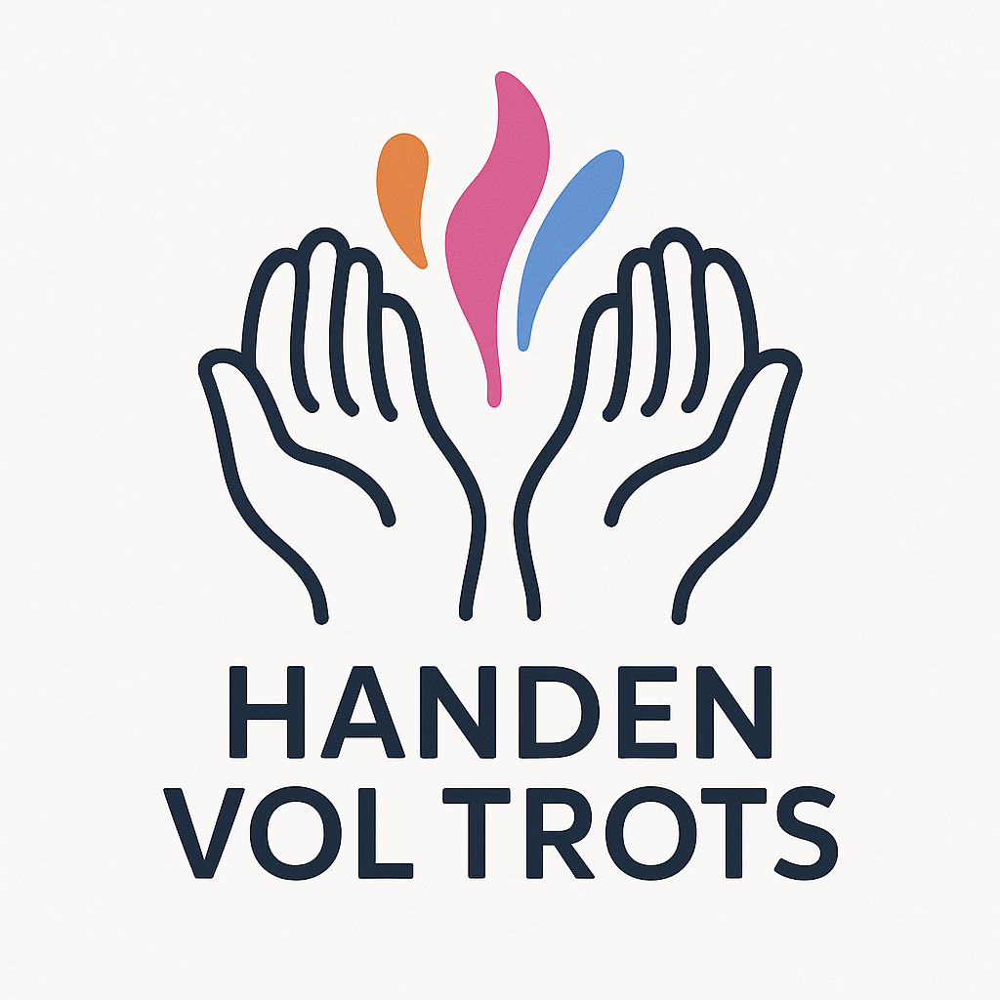
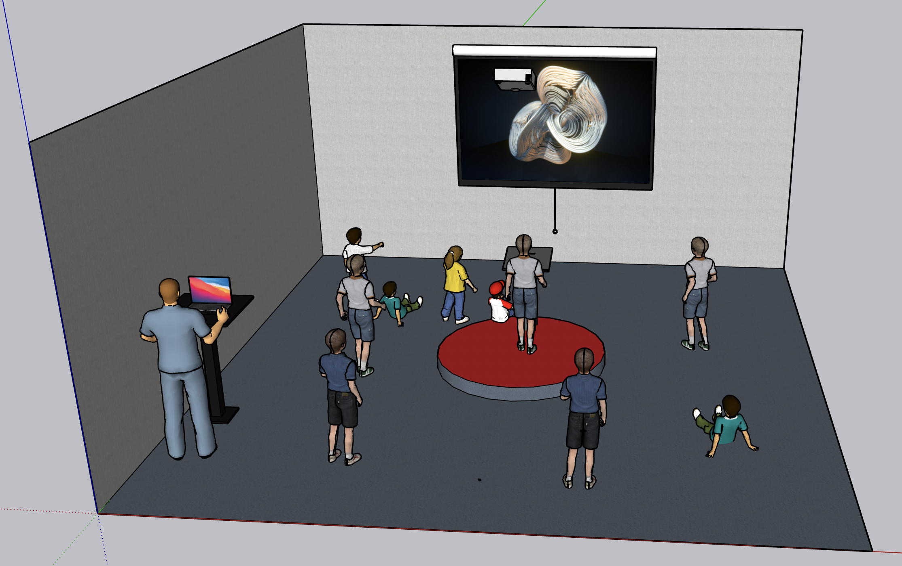

# Handen Vol Trots

  

**Wat als gebarentaal niet alleen communicatie was, maar ook kunst?**  
Een innovatieve kunstinstallatie die dove kinderen de mogelijkheid geeft om via gebarentaal visuele kunst te creëren.  
Met behulp van AI en TouchDesigner vertaalt het systeem handgebaren in interactieve visuals, waardoor een speelse, toegankelijke en inclusieve kunstervaring ontstaat.

---

## Problem Statement

Gebarentaal wordt nog vaak gezien als ‘anders’ of als iets dat zich moet aanpassen aan de horende wereld.  
Dit kan invloed hebben op hoe kinderen hun taal en identiteit ervaren.

Door gebarentaal om te zetten in kunst, laat de installatie zien hoe krachtig en mooi deze vorm van communicatie is.  
Dit helpt kinderen om trots te zijn op hun manier van uiten.

---

## Design Question

**Hoe kunnen we een interactieve kunstinstallatie creëren die dove kinderen de mogelijkheid biedt om zich vrij en trots te uiten door middel van gebarentaal?**

---

## Doel

Dit project wil de schoonheid en kracht van Nederlandse Gebarentaal (NGT) zichtbaar maken – in kunst, in technologie, in de samenleving.  
Het maakt ruimte voor spel, zelfexpressie en trots – zonder barrières.

---

## Doelgroep

Kinderen met een auditieve beperking

---

## Hoe werkt het?

Het systeem bestaat uit twee delen die samenwerken: één deel herkent handgebaren, het andere maakt daar beelden bij.

- **Gebaarherkenning** -
Met een camera worden je handen gevolgd en herkent het systeem welke Nederlandse Gebarentaal-gebaar je maakt. Zodra een gebaar is herkend, wordt het woord doorgestuurd naar het tweede deel.

- **Beeldgeneratie** -
Dit tweede deel koppelt het herkende woord aan een emotie, zoals blij, boos of verdrietig. Voor elke emotie verschijnt een ander beeld met bijpassende kleuren en bewegingen.

- **Interactieve beelden** -
Je handen worden ook hier live gevolgd, zodat de beelden reageren op je bewegingen. Denk aan de grootte, draaiing en patronen die veranderen als je je handen beweegt. Zo wordt elk gebaar niet alleen herkend, maar ook voelbaar gemaakt in het beeld.

---

## Demo

### Blijdschap/euforie

### Woede/haat

### Verdriet/eenzaam

---

## Waar is dit te gebruiken?

Voor echte impact is het belangrijk dat deze installatie zich bevindt op plekken waar dove en horende kinderen samenkomen. Het doel is niet alleen artistieke expressie, maar ook sociale verbinding en wederzijds begrip.  

**Ideale locaties zijn onder andere:**

- **Basisscholen en speciaal onderwijs** – Hier stimuleert de installatie inclusie in de klas. Dove kinderen kunnen hun taal en emoties zichtbaar maken op een manier die direct begrepen wordt, zonder woorden. Horende kinderen leren spelenderwijs over gebarentaal, zonder uitleg of barrières.
  
- **Musea voor kunst en technologie** – Als interactieve expositie trekt de installatie een breed publiek. Kinderen kunnen zelf experimenteren en de vertaalslag van taal naar kunst beleven. De installatie nodigt uit tot verwondering, ontdekken en empathie.

- **Bibliotheken en culturele centra** – Als ontmoetingsplek krijgt de installatie een laagdrempelige functie. Bezoekers kunnen kort of uitgebreid deelnemen, alleen of samen. Hier wordt gebarentaal letterlijk zichtbaar in het publieke domein.

- **Openbare ruimtes of festivals** – Denk aan stadspleinen, kinderfestivals of culturele evenementen. Op zulke plekken wordt de installatie een uitnodiging tot dialoog, contact en expressie, voor iedereen die langskomt.

---

## Impact
De kracht van deze installatie ligt in de gedeelde ervaring:
Geen uitleg nodig. Geen drempels. Gewoon doen, voelen, ervaren.

Door gebaren om te zetten in kunst, ontstaat er een nieuwe, gelijkwaardige vorm van expressie, toegankelijk voor iedereen.
In deze ruimte is gebarentaal niet iets ‘anders’, maar iets moois, iets van waarde.

Voor dove kinderen is het een bron van trots: hun taal is zichtbaar, hun stem wordt gezien.
Voor horende kinderen opent het een nieuwe wereld van communicatie, emotie en creativiteit.

Het is niet alleen een kunstinstallatie, het is een stap richting erkenning, verbondenheid en wederzijds begrip.

---

## Contact

Wil je meedenken, testen of samenwerken?  
[Jens Verhoeff / jens.verhoeff@gmail.com]

---

> *Handen Vol Trots – waar elk kind telt, en elke beweging iets mag zeggen.*
